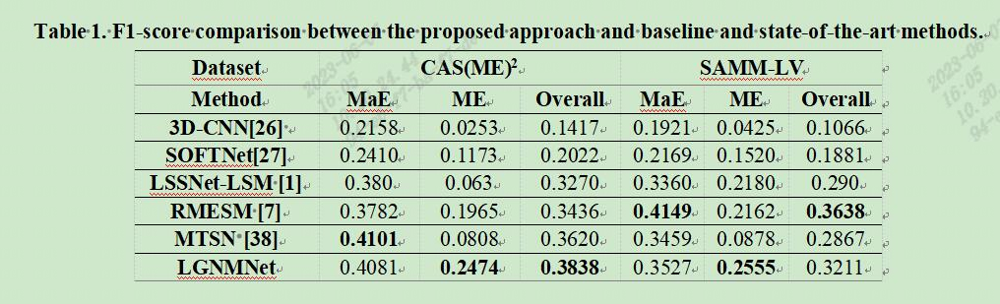

## Lite General Network And MagFace CNN for Macro- and Micro-expression Spotting from Long Videos

### Introduction

We presented an efficient expression spotting framework (LGNMNet) towards the challenge of MaE and ME spotting.

### datasets


CAS(ME)<sup>2</sup> - http://fu.psych.ac.cn/CASME/cas(me)2-en.php

SAMM Long Videos - http://www2.docm.mmu.ac.uk/STAFF/M.Yap/dataset.php

### Framework


#### images preprocess

* landmarks through the method  [FaceX-Zoo](https://github.com/JDAI-CV/FaceX-Zoo)

* extracting the optical flow features  [denseflow](https://github.com/open-mmlab/denseflow)

* removing global head motion, eye masking, ROI selection

#### Intersection rate Labeling


#### macro- and micro-expression spotting
* combine the peak detection and adjacent peak pairing methods to recognize expression intervals.
* macro- and micro-expression spotting through shorter frame skip and the network.
* merge predicted intervals for improve the performance.

### Training

* update later.

  ```python
  sh train.sh  # Tips:Adam better than SGD
  ```

### Results



### Reproducing the results

* All the folders are placed as follows and the pre-trained weights are  located under weights/.
  ```python
  ├── README.md
  ├── main_train_eval.py
  ├── data
  │   ├── train_dataset.py
  ├── doc
  │   ├── IRL.jpg
  │   ├── result.jpg
  │   └── Framework.png
  ├── log
  │   ├── CAS_Macro.log
  │   ├── CAS_Micro.log
  │   ├── SAMM_Macro.log
  │   └── SAMM_Micro.log
  ├── input
  │   ├── CAS.xlsx
  │   └── SAMM.xlsx
  ├── model
  │   ├── backbone
  │   └── head
  ├── output
  │   ├── LOG_CAS_Macro.txt
  │   ├── LOG_CAS_Micro.txt
  │   ├── LOG_SAMM_Macro.txt
  │   └── LOG_SAMM_Micro.txt
  ├── preprocess
  │   ├── densflow.py
  │   └── densflow_gpu.py
  ├── utils
  │   ├── utils.py
  │   ├── calculate.py
  │   └── find_result.py
  └── weights
      ├── CAS_Macro
      ├── CAS_Micro
      ├── SAMM_Macro
      └── SAMM_Micro
  ```
  
* Installation of packages using pip

  ```python
  docker pull bleakie/interview:tagname
  ```

* Preprocess dataset

  ```python
  # --start --end: choose the subject for processing
  # --K: the parameter which control the length of frmae skip when preprocess
  #  CAS-MAE:6,CAS-ME:18, SAMM-MAE:37, SAMM-ME:174
  ```

* evaluation

  ```python
  # evaluation
  python main_eval.py
  ```
  **All the final results are placed in the folder './log/' as follows:**
  ```python
  ├── LOG_CAS_Macro.txt
  ├── LOG_CAS_Micro.txt
  ├── LOG_SAMM_Macro.txt
  └── LOG_SAMM_Micro.txt 
  ```
  
### Contact

##### Please email us at yangsai1991@163.com if you have any inquiries or issues.
